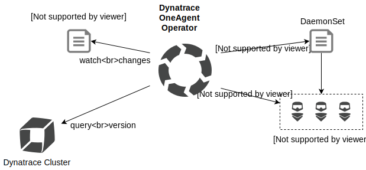

# Dynatrace OneAgent Operator Helm Chart

This is the home of Dynatrace OneAgent Operator's Helm Chart which supports the rollout and lifecycle of [Dynatrace OneAgent](https://www.dynatrace.com/support/help/get-started/introduction/what-is-oneagent/) in Kubernetes and OpenShift clusters.
Rolling out Dynatrace OneAgent via DaemonSet on a cluster is straightforward.
Maintaining its lifecycle places a burden on the operational team.
Dynatrace OneAgent Operator closes this gap by automating the repetitive steps involved in keeping Dynatrace OneAgent at its latest desired version.

## Overview

Dynatrace OneAgent Operator is based on [Operator SDK](https://github.com/operator-framework/operator-sdk) and uses its framework for interacting with Kubernetes and OpenShift environments.
It watches custom resources `OneAgent` and monitors the desired state constantly.
The rollout of Dynatrace OneAgent is managed by a DaemonSet initially.
From here on Dynatrace OneAgent Operator controls the lifecycle and keeps track of new versions and triggers updates if required.




## Quick Start

The Dynatrace OneAgent Operator acts on its separate namespace `dynatrace`.
It holds the operator deployment and all dependent objects like permissions, custom resources and
corresponding DaemonSets.
To install the Dynatrace OneAgent Operator via Helm run the following command:

### Adding Dynatrace OneAgent Helm repository
```
helm repo add dynatrace https://github.com/Dynatrace/helm-charts/tree/master/dynatrace-oneagent-operator/stable
```


#### Kubernetes
```
kubectl create namespace dynatrace
helm install dynatrace-oneagent-operator dynatrace/dynatrace-oneagent-operator -n dynatrace --set platform=kubernetes,oneagent.apiUrl=https://ENVIRONMENTID.live.dynatrace.com/api,secret.apiToken=DYNATRACE_API_TOKEN,secret.paasToken=PLATFORM_AS_A_SERVICE_TOKEN
```

#### OpenShift
```
oc adm new-project --node-selector="" dynatrace
helm install dynatrace-oneagent-operator dynatrace/dynatrace-oneagent-operator -n dynatrace --set platform=openshift,oneagent.apiUrl=https://ENVIRONMENTID.live.dynatrace.com/api,secret.apiToken=DYNATRACE_API_TOKEN,secret.paasToken=PLATFORM_AS_A_SERVICE_TOKEN
```

This will automatically install the Dynatrace OneAgent Operator and create OneAgents for every of your nodes.


## Uninstall dynatrace-oneagent-operator
Remove OneAgent custom resources and clean-up all remaining OneAgent Operator specific objects:


```sh
helm uninstall dynatrace-oneagent-operator -n dynatrace
```

## License

Dynatrace OneAgent Operator is under Apache 2.0 license. See [LICENSE](../LICENSE) for details.